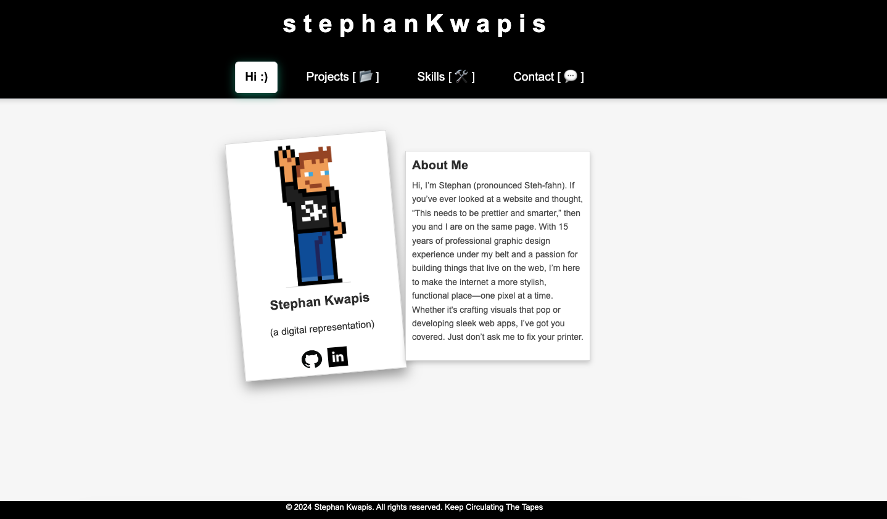

# Stephan's Portfolio (aka Billionaires-Coding-Club-A-Portfolio) 	  

## Table Of Contents
- [Description](#description)
- [Installation](#installation)
- [Usage](#usage)
- [Contributing](#contributing)
- [Visuals/Links](#visualslinks)
- [License](#license)
- [Tests](#tests)
- [Questions](#questions)

# Description
A portfolio to showcase my work and skills.

# Installation
Visit https://fancy-wisp-a79520.netlify.app/#hi to view my portfolio.

# Usage
Visit my site and check out all of the things! Check back frequently, I'm always updating it.

# Contributing
Inspiration was pulled directly from class materials and the following sources:
https://www.w3docs.com/snippets/css/how-to-create-polaroid-image-with-css.html
https://hackernoon.com/a-quick-css-guide-crafting-neon-buttons-with-glow-effects-and-animations
https://blog.hubspot.com/website/css-card-animation
https://www.emailjs.com/docs/
https://learnersbucket.com/examples/interview/create-a-lightbox-modal-image-gallery-in-reactjs/

# Visuals/Links

https://fancy-wisp-a79520.netlify.app/#hi

# License
MIT

# Tests
Lot's and lot's of console logging and breaking things until it worked.

# Questions
[GitHub Profile](https://github.com/sdkwapis)
For questions or comments please reach out to me at: sdkwapis@gmail.com